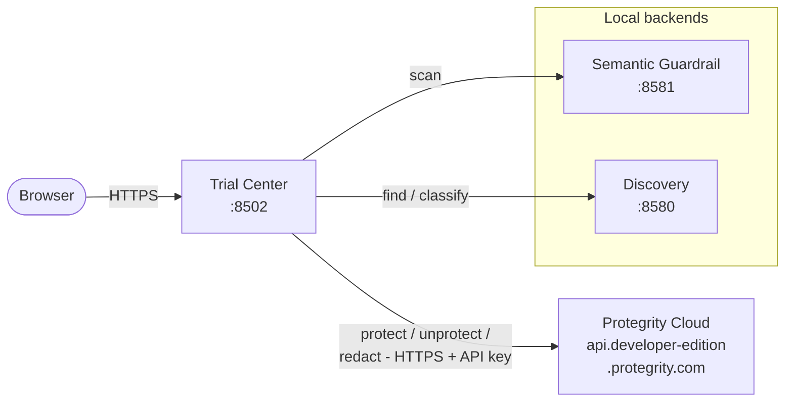

# Protegrity Developer Edition Trial Center

An interactive Streamlit application demonstrating privacy-preserving GenAI
workflows using [Protegrity Developer Edition v1.1.0](https://github.com/Protegrity-Developer-Edition/protegrity-developer-edition/tree/pre-release-1.1.0).
The Trial Center is a thin UI that calls the Semantic Guardrail and Data
Discovery / Classification services to showcase data discovery, semantic
guardrails, protection, and redaction capabilities for AI/ML pipelines.

## Overview

This Trial Center provides a hands-on environment to explore Protegrity's
privacy and security capabilities for GenAI applications:

- **Data Discovery** — automatically identify and classify sensitive data
- **Semantic Guardrail** — validate prompts for policy compliance and security
  risks using domain-specific processors (customer-support, financial,
  healthcare)
- **Protection & Unprotection** — apply reversible tokenization to sensitive
  data
- **Redaction** — irreversibly mask sensitive information
- **Interactive UI** — Streamlit interface with domain selection and pipeline
  mode configuration

## Architecture



This repository ships **only** the Trial Center UI container. The two local
backends (Semantic Guardrail `:8581`, Discovery `:8580`) are an external
prerequisite delivered by Protegrity Developer Edition. The Protegrity Cloud
API performs the actual protect/unprotect/redact tokenization and is reached
from inside the container over HTTPS using the `DEV_EDITION_*` credentials.
See [docs/ARCHITECTURE.md](docs/ARCHITECTURE.md) for the full breakdown and
[docs/GETTING_STARTED.md](docs/GETTING_STARTED.md) to get the local backends
running.

## Prerequisites

| Requirement                                             | Version | Notes                              |
| ------------------------------------------------------- | ------- | ---------------------------------- |
| Docker                                                  | 20.10+  | Docker Desktop or Docker Engine    |
| Docker Compose                                          | 2.0+    | Bundled with Docker Desktop        |
| Protegrity Developer Edition account                    | —       | [Sign up](https://www.protegrity.com/developer-edition) |
| **Semantic Guardrail** running on `localhost:8581`      | 1.1.0+  | From Protegrity Developer Edition  |
| **Classification / Discovery** running on `localhost:8580` | 1.1.1+  | From Protegrity Developer Edition  |

> **You do not need Python on the host.** The Trial Center runs entirely inside
> its Docker container.

#### Start the Backends First

```bash
git clone https://github.com/Protegrity-Developer-Edition/protegrity-developer-edition.git
cd protegrity-developer-edition
git checkout pre-release-1.1.0
docker compose up -d
```

Verify they're up:

```bash
curl -sf http://localhost:8581/ -o /dev/null && echo "Guardrail: OK"
curl -sf http://localhost:8580/ -o /dev/null && echo "Discovery: OK"
```

#### Apple Silicon / arm64

The Protegrity backend images are currently published for `linux/amd64` only.
On arm64 hosts they run via Rosetta / QEMU emulation — slower than native but
fine for trial use.

## Quick Start

```bash
# 1. Clone this repository
git clone https://github.com/ProVishP/protegrity-developer-edition-trial-center.git
cd protegrity-developer-edition-trial-center

# 2. Configure credentials
cp .env.example .env
# Edit .env and fill in DEV_EDITION_EMAIL / PASSWORD / API_KEY

# 3. Launch
./scripts/deploy.sh        # macOS / Linux  (validates prereqs first)
# or:
docker compose up -d --build
```

Open <http://localhost:8502>.

#### Windows

```cmd
scripts\deploy.bat
```

#### What the deploy script does

1. Checks Docker, Compose, port 8502, `.env`, and **backend reachability**
2. Shows a status table; exits if anything is a blocker
3. Builds and starts the `trial-center` container
4. Waits for the healthcheck to pass and prints the URL

## Configuration

Configuration is via `.env` in the project root (see [`.env.example`](.env.example)).

| Variable                       | Required | Default                                    |
| ------------------------------ | :------: | ------------------------------------------ |
| `DEV_EDITION_EMAIL`            | yes      | —                                          |
| `DEV_EDITION_PASSWORD`         | yes      | —                                          |
| `DEV_EDITION_API_KEY`          | yes      | —                                          |
| `SEMANTIC_GUARDRAIL_URL`       | no       | `http://host.docker.internal:8581`         |
| `CLASSIFICATION_SERVICE_URL`   | no       | `http://host.docker.internal:8580`         |
| `TRIAL_CENTER_PORT`            | no       | `8502`                                     |
| `TRIAL_CENTER_VERSION`         | no       | `1.1.0`                                    |
| `LOG_LEVEL`                    | no       | `INFO`                                     |

> **Without credentials**, Discovery / Guardrail / Redaction continue to work,
> but Protection / Unprotection will return errors.

## Features

| Mode                       | What it does                                                  |
| -------------------------- | ------------------------------------------------------------- |
| **Full Pipeline**          | Guardrail → Discover → Protect → Unprotect → Redact           |
| **Semantic Guardrail**     | Score prompt risk without modifying content                   |
| **Discover Sensitive Data**| Identify PII / PHI / PCI entities                             |
| **Find, Protect & Unprotect** | Reversible tokenization round-trip                         |
| **Find & Redact**          | Permanent masking (`***REDACTED***`)                          |

Domain processors: `customer-support`, `financial`, `healthcare`.

Sample prompts are bundled in the sidebar and as files under
[`tests/fixtures/`](tests/fixtures/).

## Project Structure

```
protegrity-developer-edition-trial-center/
├── README.md
├── pyproject.toml
├── requirements.txt
├── pyrightconfig.json
├── Dockerfile
├── docker-compose.yml
├── .env.example
├── .gitignore
│
├── src/trial_center/
│   ├── __init__.py
│   ├── app.py                  # Streamlit UI
│   ├── cli.py
│   ├── core/pipeline.py        # Guardrail + sanitizer logic
│   ├── api/health.py
│   └── utils/validation.py
│
├── tests/
│   ├── conftest.py
│   ├── unit/
│   └── fixtures/
│
├── scripts/
│   ├── deploy.sh               # macOS / Linux launcher
│   └── deploy.bat              # Windows launcher
│
├── docs/
│   ├── GETTING_STARTED.md
│   └── ARCHITECTURE.md
```

## Common Operations

```bash
docker compose ps                # Status
docker compose logs -f           # Tail logs
docker compose down              # Stop
./scripts/deploy.sh --check      # Re-run prerequisite check
./scripts/deploy.sh --clean      # Tear down
TRIAL_CENTER_PORT=9000 ./scripts/deploy.sh   # Custom port
```

## Troubleshooting

See [docs/GETTING_STARTED.md → Troubleshooting](docs/GETTING_STARTED.md#troubleshooting).
The two most common issues:

- **"Service Unavailable" in Steps 2–4** — backends aren't reachable from the
  trial-center container. Verify with the curl checks above.
- **Port 8502 in use** — re-run with `TRIAL_CENTER_PORT=8503 ./scripts/deploy.sh`.

## Testing

```bash
pytest -o addopts= -q              # Quick run (no coverage)
pytest                             # Full run with coverage gate (≥70%)
```

## Links

- Protegrity Developer Edition: <https://github.com/Protegrity-Developer-Edition/protegrity-developer-edition>
- Get API credentials: <https://www.protegrity.com/developers/get-api-credentials>
- Documentation: <https://developer-edition.protegrity.io/docs>

## License

MIT — see [LICENSE](LICENSE).

## Acknowledgments

Built on [Protegrity Developer Edition](https://github.com/Protegrity-Developer-Edition/protegrity-developer-edition).

> This Trial Center is an independent showcase project that uses Protegrity
> Developer Edition services. It is not officially maintained by Protegrity.
