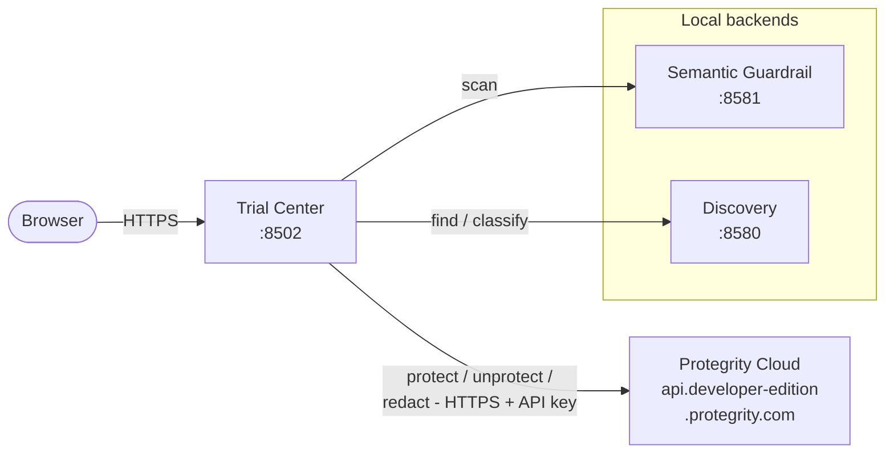

# Architecture

- **Date**: 14 May 2026
- **Type**: architecture analysis

## Executive Summary

The Protegrity AI Developer Edition Trial Center is a single-container web
application that demonstrates how Protegrity's AI guardrails, data discovery,
protection, and redaction services cooperate to secure GenAI prompts.

The Trial Center ships **only the UI container**. The Semantic Guardrail and
Classification / Discovery backend services are an external prerequisite,
delivered by [Protegrity Developer Edition](https://github.com/Protegrity-Developer-Edition/protegrity-developer-edition)
and expected to be running on the host before the Trial Center is started.

---

## Table of Contents

- [System Overview](#system-overview)
- [Container Topology](#container-topology)
- [Component Architecture](#component-architecture)
- [Data Flow](#data-flow)
- [Directory Structure](#directory-structure)
- [Configuration](#configuration)
- [Security Model](#security-model)
- [Extensibility](#extensibility)

---

## System Overview



The Trial Center container is the only service shipped by this repository.
Three external dependencies provide the data plane:

- **Semantic Guardrail (`:8581`, local)** — risk scoring of incoming prompts
  (`POST /pty/semantic-guardrail/v1.1/conversations/messages/scan`).
- **Classification / Discovery (`:8580`, local)** — entity detection
  (`POST /pty/data-discovery/v1.1/classify`). Called by the SDK as the *find*
  step of `find_and_protect`, `find_and_unprotect`, and `find_and_redact`.
- **Protegrity Developer Edition Cloud
  (`https://api.developer-edition.protegrity.com`)** — performs the actual
  tokenization (protect), detokenization (unprotect), and irreversible
  masking (redact). Authenticated by `DEV_EDITION_EMAIL`,
  `DEV_EDITION_PASSWORD`, and `DEV_EDITION_API_KEY`. This is why those
  credentials are required for any protect/redact operation but not for
  discovery or guardrail-only flows.

Both local backends must be running on the host (typically via the Protegrity
Developer Edition compose stack) before the Trial Center is started; the
Trial Center reaches them through `host.docker.internal`. The cloud API is
reached over the public internet from inside the container.

---

## Container Topology

| Service | Image | Port | Owner |
|---------|-------|------|-------|
| `trial-center` | `protegrity/trial-center:1.1.0` (built from `Dockerfile`) | 8502 | This repository |
| Semantic Guardrail | `ghcr.io/protegrity-developer-edition/semantic-guardrail` | 8581 | Protegrity Developer Edition (external) |
| Classification / Discovery | `ghcr.io/protegrity-developer-edition/classification_service` | 8580 | Protegrity Developer Edition (external) |

Only the `trial-center` service is defined in [`docker-compose.yml`](../docker-compose.yml).
The two backend services must be running independently (typically via the
Protegrity Developer Edition compose stack) before the Trial Center is started.

#### Service Discovery

From inside the `trial-center` container the backends are reached via
`host.docker.internal`, which Docker Desktop provides natively and Docker Engine
on Linux exposes through `extra_hosts: host-gateway` (configured in
[`docker-compose.yml`](../docker-compose.yml)).

Defaults:

- `SEMANTIC_GUARDRAIL_URL=http://host.docker.internal:8581`
- `CLASSIFICATION_SERVICE_URL=http://host.docker.internal:8580`

Override either variable in `.env` to point at backends running on a remote
host or non-default port.

---

## Component Architecture

```text
src/trial_center/
├── __init__.py          # Package root, version, public API exports
├── app.py               # Streamlit web UI (~1400 lines)
├── cli.py               # CLI entry point for batch processing
├── core/
│   └── pipeline.py      # Orchestration: guardrail, discovery, protect, redact
├── api/
│   └── health.py        # Health-check endpoint utilities
├── utils/
│   └── validation.py    # Input validation (length limits)
└── assets/              # Static branding assets
```

#### Core Classes

| Class | Responsibility |
|-------|---------------|
| `SemanticGuardrailClient` | Posts prompts to the guardrail REST API, returns risk scores |
| `GuardianPromptForge` | Orchestrates the full pipeline (guardrail → discover → protect → redact) |
| `PromptSanitizer` | Wraps SDK `find_and_protect` / `find_and_redact` with error handling |
| `GuardrailConfig` | Typed configuration for guardrail endpoint and domain |
| `SanitizationConfig` | Configuration for protection/redaction behaviour |

#### UI Execution Modes

| Mode | Steps | Description |
|------|-------|-------------|
| Full Pipeline | 1–5 | Guardrail → Discover → Protect → Unprotect → Redact |
| Semantic Guardrail | 1 | Risk scoring only |
| Discover Sensitive Data | 1 | Entity classification only |
| Find, Protect & Unprotect | 1–3 | Discovery → Protect → Unprotect |
| Find & Redact | 1–2 | Discovery → Redact |

---

## Data Flow

```text
User Prompt
    │
    ▼
┌─────────────────────────────────────────────────┐
│ Input Validation (length, non-empty)            │
└──────────────────────┬────────────────────────────┘
                       │
                       ▼
┌──────────────────────────────────────────────────┐
│ Semantic Guardrail Scoring                      │
│ POST /pty/semantic-guardrail/v1.1/              │
│      conversations/messages/scan                │
│ Domain: customer-support | financial | health   │
│ Returns: score, outcome, explanation            │
└──────────────────────┬──────────────────────────┘
                       │
                       ▼
┌─────────────────────────────────────────────────┐
│ Data Discovery (SDK)                            │
│ Identifies: PII, PHI, PCI entities             │
│ Returns: entity list with types + positions     │
└──────────────────────┬──────────────────────────┘
                       │
              ┌────────┴────────┐
              ▼                 ▼
┌──────────────────┐  ┌──────────────────┐
│ Protection       │  │ Redaction        │
│ (reversible)     │  │ (irreversible)   │
│ SDK: mask        │  │ SDK: redact      │
│ Returns tokens   │  │ Returns masked   │
└────────┬─────────┘  └──────────────────┘
         │
         ▼
┌──────────────────┐
│ Unprotection     │
│ (verify round-   │
│  trip integrity) │
└──────────────────┘
```

---

## Directory Structure

```text
protegrity-developer-edition-trial-center/
├── docker-compose.yml       # trial-center service definition (single service)
├── Dockerfile               # Trial Center container (python:3.12-slim)
├── .env.example             # Template for credentials and overrides
├── requirements.txt         # Python runtime dependencies
├── pyproject.toml           # Build config, [project.optional-dependencies] dev
│                            # group, plus tool settings (ruff, pytest, mypy)
├── src/trial_center/        # Application source (see Component Architecture)
├── tests/
│   ├── conftest.py          # Shared fixtures, mock credentials
│   └── unit/                # Unit tests with mocked SDK
├── scripts/
│   ├── deploy.sh            # Smart deployment (prerequisite check + compose up)
│   └── deploy.bat           # Windows equivalent
└── docs/
    ├── ARCHITECTURE.md      # This document
    └── GETTING_STARTED.md   # First-time user guide
```

---

## Configuration

All runtime configuration is read from environment variables (loaded from
`.env` at startup via `python-dotenv`). There is no YAML configuration
layer — environment variables are the single source of truth.

#### Required Environment Variables

| Variable | Purpose |
|----------|---------|
| `DEV_EDITION_EMAIL` | Protegrity Developer Edition account email |
| `DEV_EDITION_PASSWORD` | Account password |
| `DEV_EDITION_API_KEY` | API key for SDK operations |

#### Optional Environment Variables

| Variable | Default | Purpose |
|----------|---------|---------|
| `TRIAL_CENTER_PORT` | 8502 | Published UI port |
| `TRIAL_CENTER_VERSION` | 1.1.0 | Image tag built by `docker compose build` |
| `SEMANTIC_GUARDRAIL_URL` | `http://host.docker.internal:8581` | Backend URL |
| `CLASSIFICATION_SERVICE_URL` | `http://host.docker.internal:8580` | Backend URL |
| `LOG_LEVEL` | INFO | Logging verbosity |
| `ENVIRONMENT` | development | Config profile selector |

---

## Security Model

#### Input Validation

- All prompts pass through `validate_prompt()` before processing
- Length capped at configurable maximum (default: 10,000 chars)
- Non-empty / strip checks
- Domain and method parameters validated against allow-lists

#### XSS Defense (render-time escaping)

- HTML escaping is applied at the **render boundary**, not on stored data,
  so prompts and SDK responses retain their original characters when sent
  to backend services and displayed in plain-text widgets (`st.code`).
- Every dynamic value interpolated into `st.markdown(..., unsafe_allow_html=True)`
  is wrapped in `html.escape(..., quote=True)`.

#### Credential Management

- Credentials never committed to source control (`.gitignore` enforced)
- Passed to containers exclusively via environment variables
- `.env.example` provides template; `.env` is git-ignored
- Missing credentials produce clear warnings; UI still launches (degraded mode)

#### Dependency Hygiene

- Direct dependencies pinned with floor and upper bounds in
  [`requirements.txt`](../requirements.txt) and [`pyproject.toml`](../pyproject.toml)
- `streamlit>=1.37,<2` (CVE-2024-42474 path-traversal fix)
- `requests>=2.32.0,<3` (CVE-2024-35195 verify-bypass fix)
- `pip-audit` runs clean as of the current release

#### Error Handling Philosophy

- No automatic fallbacks — protection failures surface clearly
- Sensitive data never displayed when operations fail
- Silent failure detection — catches SDK calls that complete without modifying data

#### Container Security

- Base image: `python:3.12-slim` (minimal attack surface)
- Healthcheck uses `python -c urllib.request` (no `curl` install required)
- Backends are addressed by hostname (`host.docker.internal`), not by raw IP,
  so the topology stays portable between Docker Desktop and Linux Docker Engine
  (Linux uses the `host-gateway` mapping in `docker-compose.yml`).

---

## Extensibility

| Extension Point | How |
|----------------|-----|
| Add guardrail domains | Pass new domain string to `GuardrailConfig` |
| New pipeline stages | Extend `GuardianPromptForge` with additional steps |
| Alternative UI | Import `trial_center.core.pipeline` from FastAPI/Gradio/etc. |
| Additional SDK operations | Extend `PromptSanitizer` with new SDK method mappings |
| CI/CD integration | Use CLI mode (`trial_center.cli`) for batch validation |
